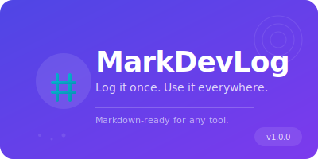
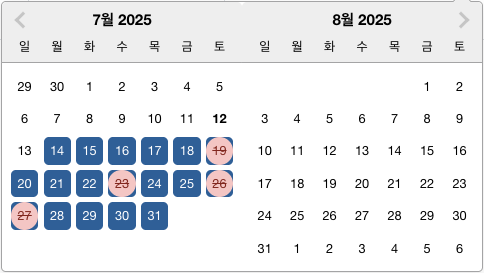

# MarkDevLog 📝  


  


---

## 📌 What is MarkDevLog?

**MarkDevLog** is a lightweight web-based tool that helps developers and teams manage daily work logs, track task progress, and export everything into clean, structured Markdown.  

This makes it easy to switch between tools like Notion, GitHub Issues, Confluence, or Redmine – wherever Markdown is supported.

> ✅ Create task lists → ✏️ Fill in "Today's Work" and "Next Work" → 📦 Export as Markdown in one click.

---

## ✨ Key Features

- 🗂️ **Task List Manager**  
  Easily add and track daily tasks with types, progress, due dates, and result links.

- ✅ **Today’s Work & Next Work Sections**  
  Write up your actual progress and plan what's next using separate, clearly structured areas.

- ⚠️ **Inline Issue Logging**  
  Add issues in context (e.g., `⚠️ Issue[Markdown error after scheduler update]`) to track blockers or bugs.

- 📅 **Holiday-aware Scheduler Support**  
  Scheduler calculations exclude holidays when configured, for more accurate duration tracking.

- 🧾 **Markdown Export**  
  Copy your full work log (including task list and all notes) into Markdown format with perfect structure and formatting.

- 💾 **Local Storage Backup**  
  Your data is saved in the browser. It persists even after refresh.

- 🌍 **Multilingual Support**  
  English and Korean supported. Automatically switches based on browser language.

- 💡 **QA-friendly Workflow**  
  Tasks can be marked as "Done", "Waiting", etc., and detailed notes can include test results, issue tracking, and handover info (e.g., "Transferred to QA after peer review").

---

## 🔥 UI Preview
### **Right-click to toggle holiday inclusion/exclusion**
* 

### **Full Screen Shot**
* 
---

## 🚀 Getting Started

### 📦 Requirements
- Node.js
- npm

### 🛠 Installation

``` bash
git clone https://github.com/your-username/markdevlog-app.git
cd markdevlog-app
npm install --legacy-peer-deps
npm start
```


## 🛠️ Tech Stack
	•	Frontend: React.js
	•	State Management: React Hooks (useState, useEffect)
	•	Internationalization: i18next & react-i18next
	•	Date & Time: date-fns
	•	Styling: Plain CSS


## 📜 License

This project is licensed under the MIT License – see the LICENSE.md file for details.